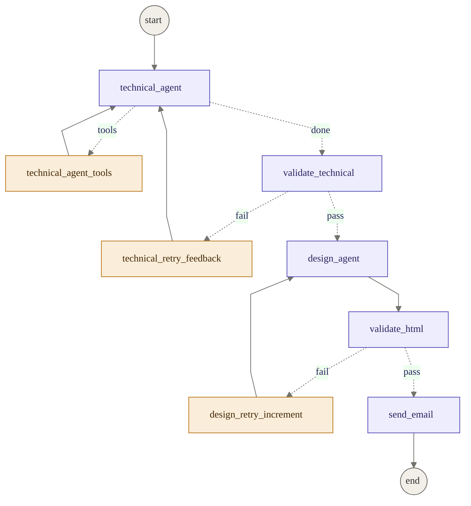

# Pipeline architecture

- **Purple** — main pipeline steps
- **Amber** — retry / loop-back paths
- **Gray** — start / end

```mermaid
---
config:
  theme: base
  themeVariables:
    fontFamily: Helvetica, Arial, sans-serif
    fontSize: 14px
    primaryColor: '#EEEDFE'
    primaryBorderColor: '#534AB7'
    primaryTextColor: '#26215C'
    lineColor: '#73726C'
    tertiaryColor: '#FAEEDA'
  flowchart:
    curve: linear
---
graph TD
    s(("start")):::terminal
    technical_agent["technical_agent"]:::primary
    technical_agent_tools["technical_agent_tools"]:::retry
    validate_technical["validate_technical"]:::primary
    technical_retry_feedback["technical_retry_feedback"]:::retry
    design_agent["design_agent"]:::primary
    validate_html["validate_html"]:::primary
    design_retry_increment["design_retry_increment"]:::retry
    send_email["send_email"]:::primary
    e(("end")):::terminal

    s --> technical_agent
    technical_agent -. tools .-> technical_agent_tools
    technical_agent -. done .-> validate_technical
    technical_agent_tools --> technical_agent
    technical_retry_feedback --> technical_agent
    validate_technical -. pass .-> design_agent
    validate_technical -. fail .-> technical_retry_feedback
    design_agent --> validate_html
    design_retry_increment --> design_agent
    validate_html -. pass .-> send_email
    validate_html -. fail .-> design_retry_increment
    send_email --> e

    classDef primary fill:#EEEDFE,stroke:#534AB7,stroke-width:1px,color:#26215C,font-weight:500;
    classDef retry fill:#FAEEDA,stroke:#BA7517,stroke-width:1px,color:#412402;
    classDef terminal fill:#F1EFE8,stroke:#5F5E5A,stroke-width:1px,color:#2C2C2A;
```