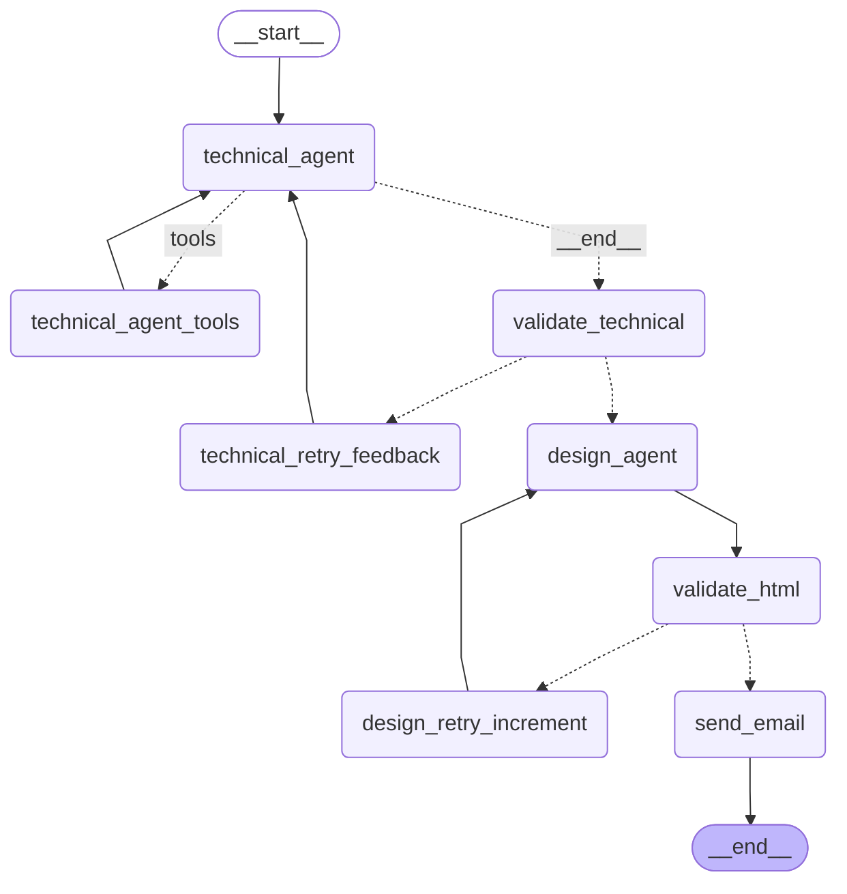

```mermaid
---
config:
  flowchart:
    curve: linear
---
graph TD;
        __start__([<p>__start__</p>]):::first
        technical_agent(technical_agent)
        technical_agent_tools(technical_agent_tools)
        validate_technical(validate_technical)
        technical_retry_feedback(technical_retry_feedback)
        design_agent(design_agent)
        validate_html(validate_html)
        design_retry_increment(design_retry_increment)
        send_email(send_email)
        __end__([<p>__end__</p>]):::last
        __start__ --> technical_agent;
        design_agent --> validate_html;
        design_retry_increment --> design_agent;
        technical_agent -. &nbsp;tools&nbsp; .-> technical_agent_tools;
        technical_agent -. &nbsp;__end__&nbsp; .-> validate_technical;
        technical_agent_tools --> technical_agent;
        technical_retry_feedback --> technical_agent;
        validate_html -.-> design_retry_increment;
        validate_html -.-> send_email;
        validate_technical -.-> design_agent;
        validate_technical -.-> technical_retry_feedback;
        send_email --> __end__;
        classDef default fill:#f2f0ff,line-height:1.2
        classDef first fill-opacity:0
        classDef last fill:#bfb6fc
```